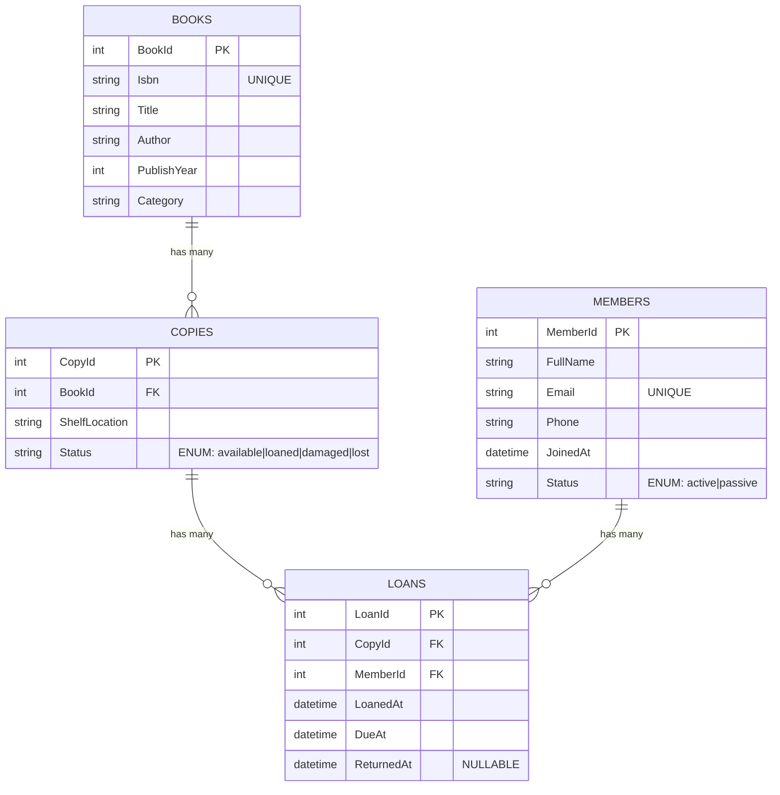

# ER Diyagramı — KutuphaneOtomasyonu

Aşağıdaki ER diyagramı, uygulamadaki temel varlıkları (Books, Copies, Members, Loans), birincil anahtarları, benzersiz kısıtları ve ilişkileri göstermektedir.

## İş Kuralları ve Kısıtlar (Özet)
- Sadece `Status = available` olan kopyalar ödünç verilebilir.
- Bir üyenin aynı anda en fazla 3 aktif (ReturnedAt IS NULL) ödünç kaydı olabilir.
- Ödünçte `DueAt = LoanedAt + 14 gün`.
- Ödünç verildiğinde `Copy.Status = loaned`, iade edildiğinde `Copy.Status = available`.

## İndeksler ve Benzersizlikler (SQL Server)
- `Books(Isbn)` üzerinde UNIQUE indeks
- `Members(Email)` üzerinde UNIQUE indeks
- Yabancı anahtarlar:
  - `Copies(BookId) → Books(BookId)` (ON DELETE RESTRICT)
  - `Loans(CopyId) → Copies(CopyId)` (ON DELETE RESTRICT)
  - `Loans(MemberId) → Members(MemberId)` (ON DELETE RESTRICT)

## Notlar
- `Status` alanları veritabanında okunabilirlik için `ENUM` karşılığı olarak `string` saklanır.
- Tarihler UTC olarak tutulur (`LoanedAt`, `DueAt`, `ReturnedAt`).

